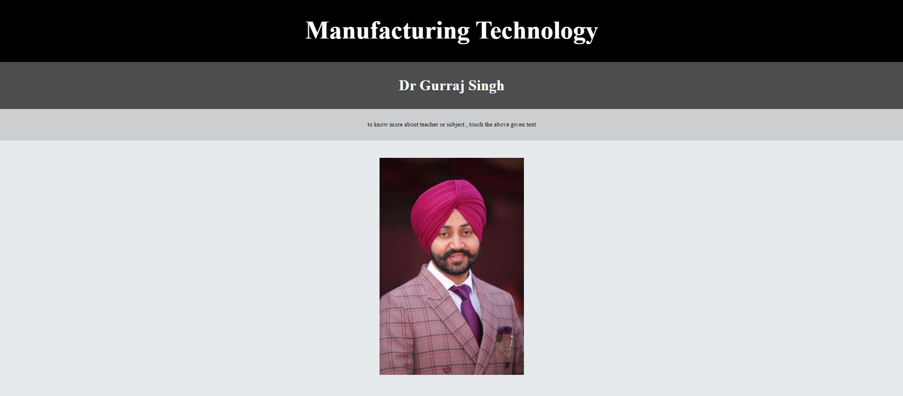
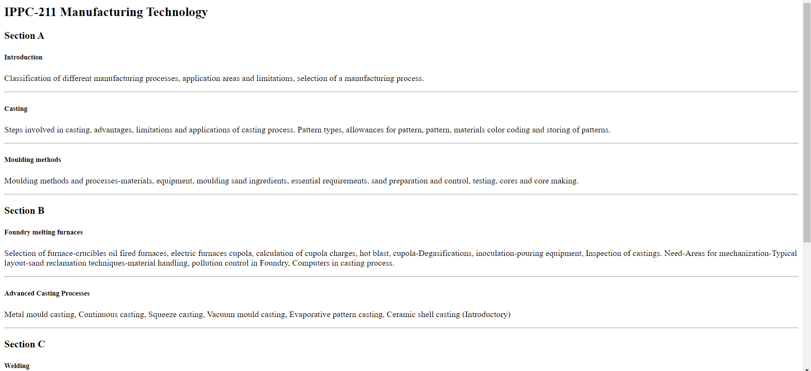

# SMART Time-table
    This is smart time-table which help students to find :
        schedule
        syllabus
        about teacher (with photo)
    
### How to use it
    Using this smart time-table is very easy.
    First you have to click the main "html" file.
    Once it is open you can see the schedule,subjets etc and you can know more about any subject,just by clicking it.

##### When you open the time-table

 

##### When you a particular subject

 

##### When the name of subject is clicked ( you can also click name of teacher to know more about hum/her )
